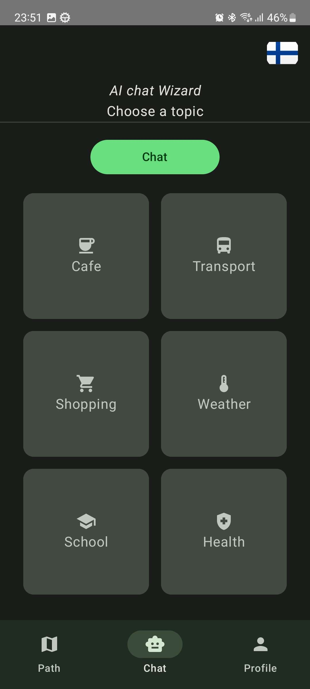
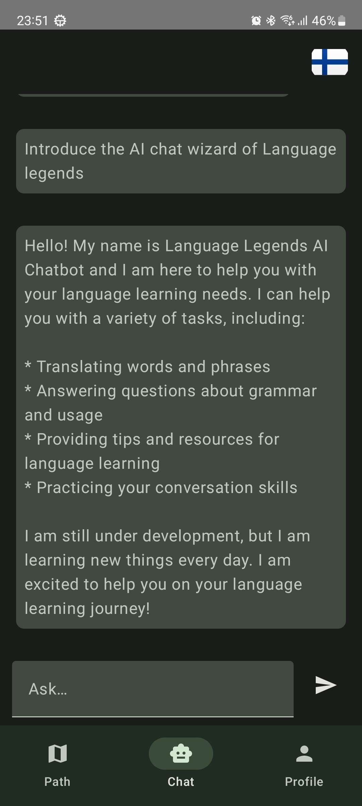
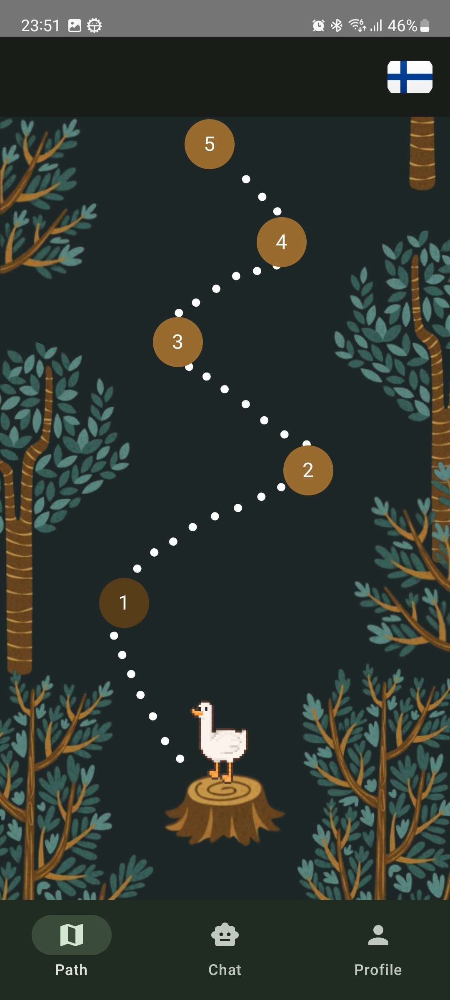
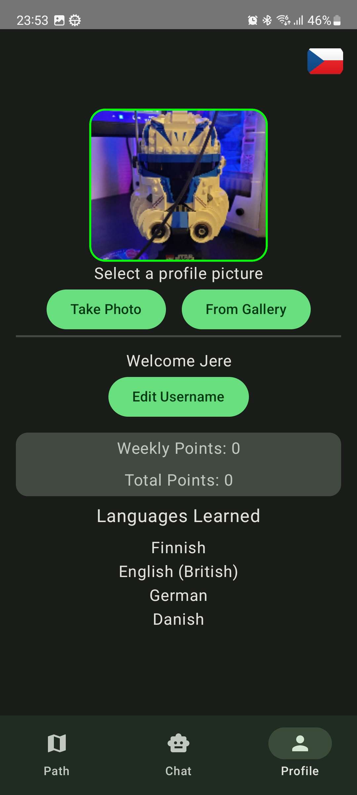

# Welcome to Language Legends!

Are you ready to embark on an epic journey of language mastery? Look no further – Language Legends is here to guide you on your path to linguistic greatness.

## Why Language Legends?

Language Legends isn't just another language learning app – it's your ticket to becoming a true language hero. Our innovative approach combines cutting-edge technology with time-tested learning methods to provide you with an immersive and effective language learning experience. Learn new languages by letting our AI-Wizard test your knowledge or adventure through the forest and complete challenging games.

## Features:

### AI-Wizard: 
Let the wizard test your knowledge in different categories or freely chat with the wizard. Easy way to test your knowledge and quickly learn useful words and sentences.

    

### Adventure Path: 
Adventure through the forest and improve your language skills. On your adventure you will come across many interesting games and activities.

  

### Point Tracking: 
See how you have been progressing your learning from your profile view. Your profile lists all your learned languages and tracks your point progress.

  

### Many languages to learn: 
20+ Languages to select from and start learning. 

## Getting Setup:
Insert your service account information and deepl api key into their files according to the templates found in assets folder. (Filenames need to be keyfile.json and deeplAPIKey.json)
